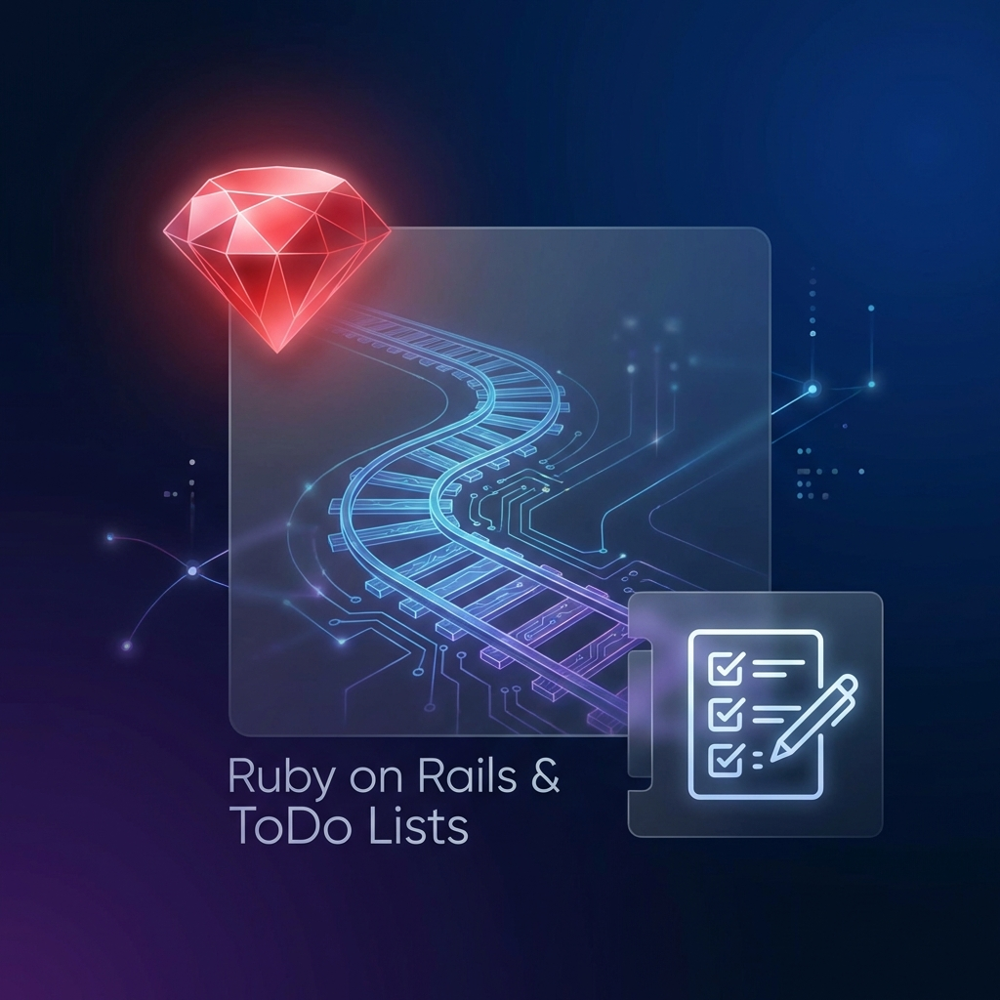

# TODO_ON_RAILS.md

> **💡 일하는 방식의 변화**
> "질문은 사람이, 대답은 AI가 합니다."
> "원하는 것은 사람이, 구현은 AI가 합니다."
> 언제든지 원하는 만큼, 새로운 방식으로 함께 성장합니다.

---

> **🎯 프로젝트 목표**



> **개발자 Background**: SpringBoot, React, Angular, Vue 개발 경험 보유
> <br>**Challenge**: AI 시대 1인 창업을 위한 다양한 프레임워크 경험 필요
> <br>**Goal**: Rails Framework을 활용하여 **TodoOnRails** 프로젝트를 직접 구현하며, Rails의 철학과 구조를 깊이 이해하는 것

## 🚀 1단계: 프로젝트 생성 및 설치

첫 번째 단계로 Rails 프레임워크를 설치하고 TodoOnRails 프로젝트를 생성하겠습니다.

### 실행할 작업:

```bash
~/…/TodoOnRails $ which ruby && gem env home
/Users/soromiso/.rbenv/shims/ruby
/Users/soromiso/.rbenv/versions/3.3.4/lib/ruby/gems/3.3.0

~/…/TodoOnRails $ brew install mysql && echo "MySQL installed successfully"

gem install rails (Rails 설치)
rails new TodoOnRails -d mysql (MariaDB 기반 프로젝트 생성)
참고: Rails는 MariaDB 어댑터로 mysql2 젬을 공통으로 사용합니다.
```

### Implementation Idea

```bash
MacOS,
MariaDB local에 설치(docker desktop) 사용중이다.

1. Ruby on Rails Framework 를 이용하여 새로운 프로젝트 TodoOnRails 를 만들고 싶다.
2. 구현 할 기능
- 로그인 (ID/PWD)
- Intro Page
- TodoList
    . 상단 조회기능, "조회", "추가"
    . Table List,
    . 하단 [Pagination, Prev, 10 Rows per page, Next] )
    . "추가" 시 추가 팝업
    . Table List 에 조회된 특정 행 선택 시 수정용 팝업
- About Page

3. MariaDB  (todo database)
   - 생성할 테이블들의 DDL 구문 알려달라.

4. Ruby on Rails  Project 설치 부터, 구조적 프로젝트 소스구현을
    내가 따라할 수 있도록 단계별로 알려 달라.

5. 각 단계를 진행하기 전에 설명과 함께 나에게 진행여부를 반드시 물어봐 달라.
```

### 🚀 TodoOnRails 프로젝트 계획 (Ruby on Rails + MariaDB)

요청하신 TodoOnRails 프로젝트를 위한 단계별 계획을 수립했습니다.

📋 주요 내용
Framework: Ruby on Rails (최신 버전)
DB: MariaDB (Docker 연결)
UI: Hotwire(Turbo)를 이용한 SPA 느낌의 팝업/수정 구현
기능: 로그인, 투두 관리(CRUD, 페이징, 검색), 소개 페이지

### 🚀 1단계: 프로젝트 생성 및 설치

첫 번째 단계로 Rails 프레임워크를 설치하고 프로젝트를 생성하겠습니다.

실행할 작업:

gem install rails (Rails 설치)
rails new TodoOnRails -d mysql (MariaDB 기반 프로젝트 생성)
참고: Rails는 MariaDB 어댑터로 mysql2 젬을 공통으로 사용합니다.

### 🚀 bin/ 폴더에 있는 스크립트(실행 파일)들의 용도를 표로 정리했습니다. 이 파일들은 프로젝트 뿌리(Root)에서 bin/명령어 형태로 실행합니다.

| 파일명                  | 용도 및 설명                                                                                                 | 자주 쓰는 명령어 예시                                                                   |
| :---------------------- | :----------------------------------------------------------------------------------------------------------- | :-------------------------------------------------------------------------------------- |
| **`rails`**             | **가장 중요!** Rails 프레임워크의 모든 기능을 실행하는 만능 명령어입니다. (서버 실행, 콘솔, 코드 생성 등)    | `bin/rails server` (서버 켜기)<br>`bin/rails console` (콘솔)<br>`bin/rails g model ...` |
| **`rake`**              | Ruby의 빌드 도구인 Rake 작업을 실행합니다. (DB 마이그레이션 등) Rails 명령어에 통합되어 요즘은 잘 안 씁니다. | `bin/rake db:migrate`<br>(`bin/rails db:migrate`와 동일)                                |
| **`setup`**             | 프로젝트 초기 세팅을 도와주는 스크립트입니다. DB 생성, 라이브러리 설치 등을 한 번에 해줍니다.                | `bin/setup`<br>(처음 프로젝트 받으면 딱 한 번 실행)                                     |
| **`dev`**               | 개발 서버를 실행하는 단축 명령어입니다. (보통 Procfile을 사용하는 Foreman 등을 실행하도록 커스텀됩니다.)     | `bin/dev`                                                                               |
| **`ci`**                | `config/ci.rb`에 정의된 **CI(테스트, 보안 점검)** 과정을 실행합니다.                                         | `bin/ci`                                                                                |
| **`rubocop`**           | Ruby 코드 스타일 검사기(Linter)를 실행합니다. 코드가 못생겼는지 검사해줍니다.                                | `bin/rubocop`                                                                           |
| **`brakeman`**          | Rails 보안 취약점 정적 분석 도구를 실행합니다.                                                               | `bin/brakeman`                                                                          |
| **`bundler-audit`**     | 사용하는 젬(Gem)들의 보안 취약점을 검사합니다.                                                               | `bin/bundler-audit`                                                                     |
| **`docker-entrypoint`** | Docker 컨테이너가 실행될 때 맨 처음 실행되는 진입점 스크립트입니다. (우리가 직접 실행할 일은 없음)           | (Docker가 자동 실행)                                                                    |
| **`thrust`**            | Puma 웹 서버 앞단에서 정적 파일을 빠르게 서빙해주는 가속기(Thruster)를 실행합니다.                           | (배포 시 자동 실행)                                                                     |

### 🚀 서버 실행 방법

브라우저에서 확인하기 위해 서버를 실행하는 방법은 두 가지가 있습니다. 편한 것을 골라서 사용하시면 됩니다.

터미널을 열고 프로젝트 폴더(TodoOnRails)에서 아래 명령어 중 하나를 입력하세요.

1. 표준 실행 방법 (추천)

```bash
# rbenv를 현재 쉘에 적용
eval "$(rbenv init - zsh)"
# 다시 버전 확인
ruby -v

bin/rails server
# 또는 짧게 bin/rails s 라고 쳐도 됩니다.
# 가장 기본적이고 확실한 방법입니다.
```

2. 개발용 단축 명령어

```bash
bin/dev
```

이 명령어는 Foreman을 실행하여 개발 서버를 시작합니다.

### ⚔️ 한 눈에 비교 (VS)

| 구분             | Rails (CookieStore)                       | Spring Boot (JWT)                          |
| :--------------- | :---------------------------------------- | :----------------------------------------- |
| **형태**         | 암호화된 문자열 (읽기 불가 🔒)            | Base64 문자열 (누구나 읽기 가능 👀)        |
| **핵심 원리**    | 기밀성 (내용을 숨김)                      | 무결성 (내용이 안 바뀌었음을 보장)         |
| **장소**         | 주로 Cookie에 저장                        | 주로 HTTP Header (Authorization)에 실음    |
| **앱(App) 연동** | 모바일 앱에서 쓰기엔 쿠키 처리가 번거로움 | 모바일 앱, 다른 서버 등 어디서든 쓰기 편함 |
| **사이즈**       | 쿠키 제한 (4KB) 때문에 작아야 함          | 토큰 자체가 길어질 수 있음                 |

🧐 결론: 왜 Rails는 이걸 쓸까?
Rails는 **"웹 개발의 생산성"**을 최우선으로 하기 때문입니다. 웹 브라우저 환경에서는 **쿠키(Cookie)**가 가장 다루기 쉽고 보안 기능(HttpOnly, Secure 등)이 강력합니다. 굳이 JWT처럼 복잡하게 헤더에 붙이고, 로컬스토리지에 저장하고 할 필요 없이 **"그냥 로그인하면, 알아서 다 된다"**는 철학입니다.

반면 Spring Boot는 엔터프라이즈 환경, 앱 연동, 마이크로서비스 확장을 고려하기 때문에 범용적인 JWT를 표준처럼 사용합니다.

### 🧐 Q: Stateless 방식을 사용하는 큰 동기는 Web 서버를 병렬로 두고 서비스 하기 위한 것도 있는데, Rails (CookieStore) 은 적정한 방식인가?

**결론부터 말씀드리면 "네, 아주 적정하며 강력한 방식입니다."** 🙆‍♂️

질문하신 대로 서버를 여러 대(Scale-out)로 늘렸을 때, **"어떤 서버가 요청을 받더라도 똑같이 처리가 가능한가?"**가 핵심인데, Rails의 `CookieStore`는 이 조건을 완벽하게 충족합니다.

그 이유를 **서버 확장(Scaling)** 관점에서 설명해 드릴게요.

1.  **🌈 모든 서버가 "같은 열쇠"를 공유합니다**
    서버가 1대든 100대든 상관없습니다. 모든 Rails 서버는 배포될 때 **`config/master.key` (또는 `SECRET_KEY_BASE` 환경변수)**라는 똑같은 비밀키를 가지고 시작합니다.
    - **User ➔ Server A**: A서버가 비밀키로 암호화된 쿠키를 발급합니다.
    - **User ➔ Server B**: (로드밸런서가 B로 보냄) B서버도 A와 똑같은 비밀키를 가지고 있으므로, A가 만든 쿠키를 문제없이 해독하고 읽을 수 있습니다.
    - 즉, **별도의 세션 서버(Redis 등)가 없어도** 자연스럽게 서버 확장이 가능합니다.

2.  **🚫 "Sticky Session"이 필요 없습니다**
    만약 세션을 **서버의 메모리(In-memory)**에 저장한다면, 사용자는 무조건 처음에 접속했던 그 서버로만 계속 연결되어야 합니다. (이걸 Sticky Session이라고 합니다. 로드밸런싱의 효율이 떨어지죠.)

    하지만 `CookieStore`는 서버가 아무것도 기억하지 않으므로, **요청마다 다른 서버에 붙어도 로그인이 유지**됩니다. 진정한 의미의 **Stateless**를 구현한 것이죠.

3.  **🤔 그렇다면 언제 Redis 같은 별도 저장소가 필요한가요?**
    Rails에서도 `CookieStore` 대신 Redis 저장소를 써야 할 때가 있습니다.
    - **용량 초과**: 쿠키는 4KB밖에 안 됩니다. 세션에 너무 많은 정보를 담아야 할 때.
    - **보안 강제 종료**: "현재 로그인 중인 모든 기기에서 강제 로그아웃 시키고 싶다!" (CookieStore는 발급된 쿠키가 만료될 때까지 서버가 강제로 뺏을 방법이 마땅치 않습니다. Redis는 그냥 지워버리면 되니까요.)

#### 📝 요약

Spring Boot + JWT가 "토큰을 검증"해서 Stateless를 만드는 것처럼, Rails + CookieStore는 **"암호화된 쿠키를 공유"**해서 Stateless를 만듭니다.

따라서 **1인 창업**이나 **초기~중기 스타트업** 규모에서는 복잡하게 Redis 세션 서버를 구축할 필요 없이, **기본 `CookieStore`만으로도 충분히 서버 확장이 가능합니다.** 🚀

#### 📝 routes.rb 파일에서

```ruby
    resources :todos
```

📋 생성되는 7가지 경로와 역할
| 역할 | HTTP 동사 | URL 경로 (URI Pattern) | 컨트롤러 액션 | 설명 | 경로 별칭 (Prefix) |
| :--- | :---: | :--- | :---: | :--- | :--- |
| **목록 조회** | `GET` | `/todos` | `index` | 모든 할 일 목록을 보여줍니다. | `todos_path` |
| **추가 화면** | `GET` | `/todos/new` | `new` | 새로운 할 일을 입력하는 **폼(화면)**을 보여줍니다. | `new_todo_path` |
| **생성 처리** | `POST` | `/todos` | `create` | 폼에서 입력한 데이터를 받아 실제로 **DB에 저장**합니다. | `todos_path` |
| **상세 조회** | `GET` | `/todos/:id` | `show` | 특정 할 일(`:id`) 하나만 자세히 보여줍니다. | `todo_path(@todo)` |
| **수정 화면** | `GET` | `/todos/:id/edit` | `edit` | 기존 할 일을 수정하는 **폼(화면)**을 보여줍니다. | `edit_todo_path(@todo)` |
| **수정 처리** | `PATCH/PUT` | `/todos/:id` | `update` | 폼에서 수정한 데이터를 받아 실제로 **DB를 갱신**합니다. | `todo_path(@todo)` |
| **삭제 처리** | `DELETE` | `/todos/:id` | `destroy` | 특정 할 일(`:id`)을 **DB에서 삭제**합니다. | `todo_path(@todo)` |

## License

MIT License: https://choosealicense.com/licenses/mit/
수정, 배포, 상업적 이용이 자유로운 라이선스입니다.
단, 저작권 고지와 라이선스 전문을 표기해야 하며,
소프트웨어에 대한 보증 책임은 없습니다.

## Author

Joshua Park
soromiso@gmail.com
